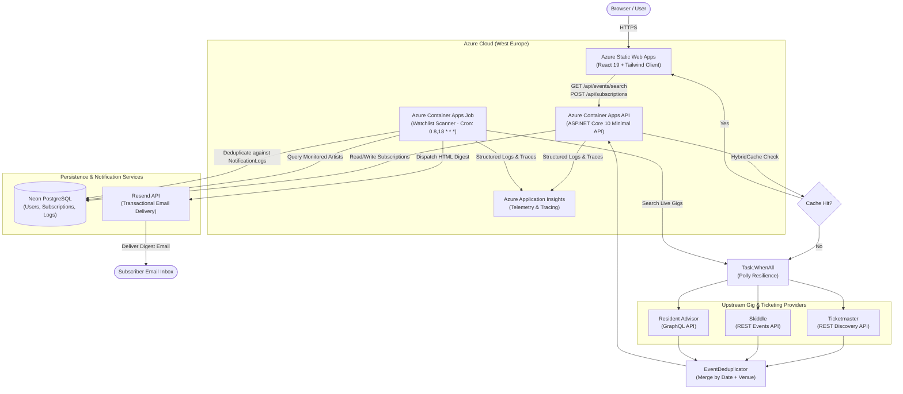

# ElectronicLive

> A high-performance London EDM and live gig tracker that aggregates, normalizes, and deduplicates event listings across major ticketing platforms into a unified schedule.

[](https://proud-island-08131590f.1.azurestaticapps.net/)
[](https://dotnet.microsoft.com/)
[](https://react.dev/)
[](https://www.typescriptlang.org/)
[](https://azure.microsoft.com/)
[](https://www.terraform.io/)

---

## 🌐 Live Application

* **Web Client:** [https://proud-island-08131590f.1.azurestaticapps.net/](https://proud-island-08131590f.1.azurestaticapps.net/)
* **API Health Check:** `https://electroniclive-api.calmglacier-47209930.westeurope.azurecontainerapps.io/api/health`

> ℹ️ **Note on Initial Load:** The backend runs on Azure Container Apps with on-demand scaling (`min_replicas = 0`) to optimize cloud costs. The first search may take around 10 seconds to spin up the service; subsequent searches are instant.

---

## 📌 Problem & Overview

Finding upcoming electronic music events across London typically requires checking multiple disconnected platforms (Ticketmaster, Skiddle, Resident Advisor), each with differing search semantics, duplicate listings, and varying ticket availability states.

**ElectronicLive** acts as a centralized **Aggregator / BFF (Backend-For-Frontend)**. It queries multiple event providers concurrently, correlates and deduplicates identical events across different vendor naming conventions, and delivers an instant, consolidated search experience alongside automated artist watchlist email alerts.

---

## ✨ Key Features

* **Parallel Multi-Provider Search:** Queries Ticketmaster, Skiddle, and Resident Advisor simultaneously using non-blocking asynchronous I/O (`Task.WhenAll`).
* **Date Range & Quick Presets:** Filter London electronic events by time window using instant one-click presets (*Tonight*, *This Weekend*, *Next Weekend*, *Next 30 Days*) or an anchored custom calendar range picker (`react-datepicker` + `date-fns` outputting ISO `YYYY-MM-DD` bounds). Supports date-only queries capped at 7 days for fast upstream indexing, and up to 30+ days when combined with artist or genre keywords.
* **Genre Taxonomy Aggregation:** Discovers London electronic music events by standardized genre classifications (Techno, House, Drum & Bass, Trance, Garage), mapping directly to Ticketmaster music classifications, Skiddle club codes/genre IDs (`g=...`), and Resident Advisor search indexes without false-positive venue collisions.
* **Smart Deduplication & Venue Normalization:** Merges cross-platform duplicates into a single event card with multiple ticket purchase links (e.g. matching *"Drumsheds"* against *"The Drumsheds, London"*).
* **Artist Watchlist & Email Alerts:** Follow favourite electronic artists in London. A scheduled background scanner inspects upcoming gigs twice daily and dispatches responsive HTML email digests via Resend with deterministic event deduplication (`NotificationLog`) and one-click tokenized unsubscribe.
* **Resilient Graceful Degradation:** Built with Polly resilience pipelines; if an upstream vendor times out or errors, the API still returns results from healthy providers.
* **Low-Latency Response Caching:** Uses .NET 10 `HybridCache` (L1 in-memory) to serve repeated queries with near-zero latency. Canonical artist/genre schedules are cached and sliced in memory, while date-only searches are partitioned by date range.
* **URL-Synced Search & UI:** React 19 client with orthogonal deep-linking query parameters (`?q=...`, `?genre=...`, `?from=...&to=...`), instant artist, venue, and genre quick-filter presets, responsive dark UI, anchored custom date range dropdown (`react-datepicker`), and skeleton loading states.

---

## 🏛️ System Architecture



---

## 🛠️ Tech Stack

| Domain | Technologies & Libraries |
| :--- | :--- |
| **Backend API & Scanner** | .NET 10 (C# 13), ASP.NET Core Minimal APIs, `Microsoft.Extensions.Resilience` (Polly), `Microsoft.Extensions.Caching.Hybrid` |
| **Persistence & Data** | PostgreSQL (Neon.tech), Entity Framework Core 10 (`Npgsql.EntityFrameworkCore.PostgreSQL`), SQLite (local dev & testing) |
| **Email & Background Processing** | Resend API, Azure Container Apps Jobs (scheduled cron runner) |
| **Frontend** | React 19, TypeScript (Strict Mode), Vite, TanStack Query v5, Tailwind CSS v4 |
| **Testing** | xUnit, Shouldly, NSubstitute (Backend) · Vitest, React Testing Library, Mock Service Worker / MSW (Frontend) |
| **Cloud & DevOps** | Azure Container Apps & Jobs, Azure Static Web Apps, Log Analytics, Application Insights, Terraform (IaC), GitHub Actions (OIDC Deployments) |

---

## 📂 Repository Structure

```text
├── backend/
│   ├── src/ElectronicLive.Api/       # .NET 10 Minimal API, scanner job runner, EF Core models & clients
│   └── tests/                        # Comprehensive unit & integration tests (xUnit, NSubstitute)
├── client/
│   ├── src/                          # React 19 application (components, hooks, MSW test fixtures)
│   └── public/                       # Static web assets & icons
├── infra/                            # Terraform configurations for all Azure cloud infrastructure
├── docs/                             # Architecture Decision Records (ADRs) and domain specifications
├── CONTEXT.md                        # Ubiquitous domain language and entity glossary
└── .github/workflows/                # Automated CI/CD pipelines for backend, frontend, and infra
```

---

## ⚙️ Engineering Decisions & Trade-offs

### 1. Hybrid Persistence Architecture: Stateless Event Aggregation + Relational Watchlist Storage
* **Decision:** Keep event discovery 100% stateless and cached in-memory via `HybridCache`, while persisting user subscriptions, notification history, and deduplication fingerprints in a relational PostgreSQL database (Neon).
* **Rationale:** Event dates, ticket links, and live statuses (*OnSale* vs. *SoldOut*) change dynamically across ticketing providers; querying on-demand avoids maintaining heavy background scrapers, database synchronization workers, and stale relational catalog state. Conversely, user watchlists, artist subscriptions, and notification deduplication fingerprints require ACID transactions, relational foreign key constraints, and persistent state.

### 2. Upstream Fault Isolation
* **Decision:** Wrap each provider call in isolated exception blocks alongside Polly resilience handlers (`AddStandardResilienceHandler`).
* **Rationale:** Third-party ticketing APIs frequently suffer from rate limits or transient downtime. The aggregator only fails with HTTP 502 if **all** upstream providers fail; otherwise, it returns a partial healthy dataset.

### 3. Cross-Vendor Venue Normalization
* **Decision:** Strip common regional suffixes (`", London"`, `", UK"`), leading articles (`"The "`), and punctuation to generate a normalized composite key (`yyyy-MM-dd_{normalizedVenue}`).
* **Rationale:** Each ticketing vendor labels venues differently (e.g. *"The Drumsheds"* vs. *"Drumsheds London"*). Normalization enables seamless merging of duplicate event rows while retaining multi-vendor ticket purchase links.

---

## 📡 API Usage & Endpoints

### Event Search (`GET /api/events/search`)

Searches and aggregates live London EDM events across Ticketmaster, Skiddle, and Resident Advisor.

#### Query Parameters

| Parameter | Type | Required | Description |
| :--- | :--- | :--- | :--- |
| `query` | string | Optional* | Free-text artist name or venue query (e.g. `Bicep`, `Printworks`). |
| `genre` | string | Optional* | Curated electronic music genre (`techno`, `house`, `drum-and-bass`, `trance`, `garage`). |
| `from` | ISO date (`YYYY-MM-DD`) | Optional* | Filter events occurring on or after this date. Required if no `query` or `genre` provided. |
| `to` | ISO date (`YYYY-MM-DD`) | Optional* | Filter events occurring on or before this date. Required if no `query` or `genre` provided. |
| `city` | string | Optional | Target metropolitan city area (defaults to `London`). |

*\*At least one of `query`, `genre`, or a date range pair (`from` + `to`) must be provided.*

#### Date Filtering Rules & Guardrails

1. **Date-Only Search Cap:** When querying by date bounds without an artist `query` or `genre`, the window between `from` and `to` cannot exceed **7 days** (`to - from <= 7`). This protects upstream provider rate limits and avoids unbounded fan-out over city-wide schedules.
2. **Context-Enriched Search:** When querying with a `query` or `genre`, date ranges can span up to 30+ days. The backend retrieves the canonical schedule, caches it in `HybridCache`, and performs precise in-memory date slicing.
3. **Resident Advisor Upstream Bypass:** Resident Advisor's GraphQL search index requires a keyword search term and does not support date-only scans. For date-only requests (`from` + `to` without `query`/`genre`), Resident Advisor is safely bypassed while Ticketmaster and Skiddle are queried upstream.
4. **Ordering & Validation:** `to` must be greater than or equal to `from`. Violations immediately return RFC 7807 `400 Bad Request` Problem Details.

```bash
# Search events for an artist within a date range
curl "http://localhost:5275/api/events/search?query=Bonobo&from=2026-10-01&to=2026-10-31"

# Search weekend events by genre
curl "http://localhost:5275/api/events/search?genre=techno&from=2026-10-09&to=2026-10-11"

# Date-only city search (max 7-day window)
curl "http://localhost:5275/api/events/search?from=2026-10-01&to=2026-10-07"
```

---

## 🚀 Local Development

### Prerequisites
* [.NET 10 SDK](https://dotnet.microsoft.com/download/dotnet/10.0)
* [Node.js 22+](https://nodejs.org/) & `npm`

### 1. Backend Setup
```bash
# Navigate to backend and restore dependencies
dotnet restore backend/ElectronicLive.sln

# Run the API locally (defaults to https://localhost:7123 / http://localhost:5275)
dotnet run --project backend/src/ElectronicLive.Api
```

> **Local Persistence Note:** When running locally without a PostgreSQL connection string, the application automatically defaults to a local SQLite database (`electroniclive.db`) with automatic schema creation.

### 2. Watchlist Scanner CLI Job
To manually execute the scheduled watchlist scanner job locally:
```bash
dotnet run --project backend/src/ElectronicLive.Api -- --job scan-watchlist
```

### 3. Local Testing Guide: Background Service & Email Dispatching
ElectronicLive uses a dual-mode dispatching architecture to support both offline development and live delivery testing:

1. **Default Offline Mode (Zero Setup):**
   * Leave `Resend:ApiKey` empty or omitted in `appsettings.json`.
   * The API automatically registers `LoggingEmailDispatcher`.
   * Running the scanner (`dotnet run --project backend/src/ElectronicLive.Api -- --job scan-watchlist`) logs progress to the console and generates fully rendered preview `.html` files in `.scratch/emails/`.
   * Open these files in any web browser to inspect dark-mode styling, responsive event cards, and ticket provider links.
2. **Live Delivery Testing Mode (Resend):**
   * Add your Resend API credentials to `backend/src/ElectronicLive.Api/appsettings.secrets.json` (or via environment variables):
     ```json
     {
       "Resend": {
         "ApiKey": "re_test_key...",
         "FromEmail": "ElectronicLive <onboarding@resend.dev>"
       }
     }
     ```
   * Running the scanner or creating subscriptions will automatically activate `ResendEmailDispatcher` and deliver live transactional emails to real inboxes.

### 4. Environment Variables Reference

| Environment Variable | Description | Default / Fallback |
| :--- | :--- | :--- |
| `ConnectionStrings__DefaultConnection` | PostgreSQL connection string (e.g., Neon.tech) | Falls back to local `electroniclive.db` (SQLite) |
| `Resend__ApiKey` | Resend API key for sending email digests | Omitting activates `LoggingEmailDispatcher` (HTML file output) |
| `Resend__FromEmail` | Sender email address for outgoing digests | `ElectronicLive <onboarding@resend.dev>` |
| `EventProviders__Ticketmaster__ApiKey` | Ticketmaster API consumer key | Mock fallback data |
| `EventProviders__Skiddle__ApiKey` | Skiddle API key | Mock fallback data |
| `APPLICATIONINSIGHTS_CONNECTION_STRING` | Azure Application Insights telemetry string | Optional / disabled locally |

### 5. Frontend Setup
```bash
# Navigate to client and install dependencies
cd client
npm install

# Start Vite development server (proxies /api to local backend)
npm run dev
```

### 6. Running Test Suites
```bash
# Run backend unit and integration tests (xUnit)
dotnet test backend/ElectronicLive.sln

# Run frontend tests (Vitest + React Testing Library + MSW)
cd client
npm run test
```

---

## 🚢 CI/CD & Deployment

All infrastructure is provisioned through Terraform in [`infra/`](infra/) and deployed via GitHub Actions using OIDC authentication:

* **Backend API & Scanner:** Automated pipeline builds the .NET application, executes tests, packages a minimal container image pushed to GitHub Container Registry (GHCR), deploys API revisions to **Azure Container Apps**, and configures the scheduled **Azure Container Apps Job**.
* **Frontend:** Builds the production Vite bundle and deploys to **Azure Static Web Apps**.