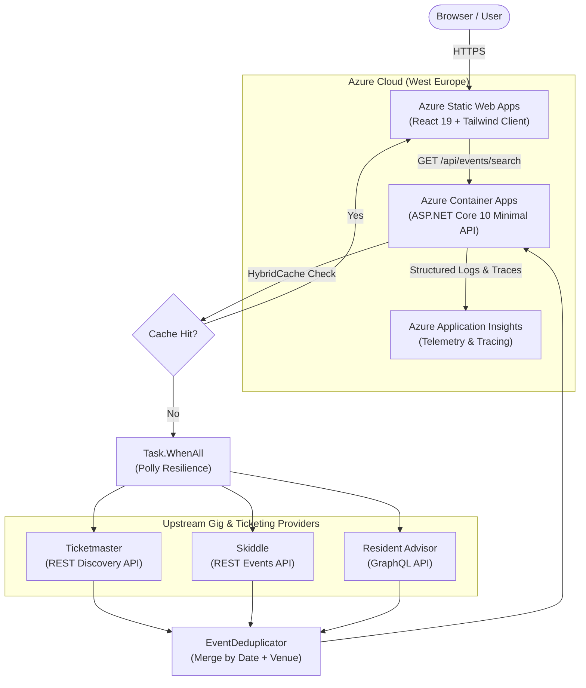

# ElectronicLive

> A high-performance London EDM and live gig tracker that aggregates, normalizes, and deduplicates event listings across major ticketing platforms into a unified schedule.

[](https://proud-island-08131590f.1.azurestaticapps.net/)
[](https://dotnet.microsoft.com/)
[](https://react.dev/)
[](https://www.typescriptlang.org/)
[](https://azure.microsoft.com/)
[](https://www.terraform.io/)

---

## 🌐 Live Application

* **Web Client:** [https://proud-island-08131590f.1.azurestaticapps.net/](https://proud-island-08131590f.1.azurestaticapps.net/)
* **API Health Check:** `https://electroniclive-api.calmglacier-47209930.westeurope.azurecontainerapps.io/api/health`

---

## 📌 Problem & Overview

Finding upcoming electronic music events across London typically requires checking multiple disconnected platforms (Ticketmaster, Skiddle, Resident Advisor), each with differing search semantics, duplicate listings, and varying ticket availability states.

**ElectronicLive** acts as a centralized **Aggregator / BFF (Backend-For-Frontend)**. It queries multiple event providers concurrently, correlates and deduplicates identical events across different vendor naming conventions, and delivers an instant, consolidated search experience.

---

## ✨ Key Features

* **Parallel Multi-Provider Search:** Queries Ticketmaster, Skiddle, and Resident Advisor simultaneously using non-blocking asynchronous I/O (`Task.WhenAll`).
* **Genre Taxonomy Aggregation:** Discovers London electronic music events by standardized genre classifications (Techno, House, Drum & Bass, Trance, Garage), mapping directly to Ticketmaster music classifications, Skiddle club codes/genre IDs (`g=...`), and Resident Advisor search indexes without false-positive venue collisions.
* **Smart Deduplication & Venue Normalization:** Merges cross-platform duplicates into a single event card with multiple ticket purchase links (e.g. matching *"Drumsheds"* against *"The Drumsheds, London"*).
* **Resilient Graceful Degradation:** Built with Polly resilience pipelines; if an upstream vendor times out or errors, the API still returns results from healthy providers.
* **Low-Latency Response Caching:** Uses .NET 10 `HybridCache` (L1 in-memory) to serve repeated queries with near-zero latency.
* **URL-Synced Search & UI:** React 19 client with deep-linking query parameters (`?q=...`, `?genre=...`), instant artist, venue, and genre quick-filter presets, responsive dark UI, and skeleton loading states.

---

## 🏛️ System Architecture



---

## 🛠️ Tech Stack

| Domain | Technologies & Libraries |
| :--- | :--- |
| **Backend API** | .NET 10 (C# 13), ASP.NET Core Minimal APIs, `Microsoft.Extensions.Resilience` (Polly), `Microsoft.Extensions.Caching.Hybrid` |
| **Frontend** | React 19, TypeScript (Strict Mode), Vite, TanStack Query v5, Tailwind CSS v4 |
| **Testing** | xUnit, Shouldly, NSubstitute (Backend) · Vitest, React Testing Library, Mock Service Worker / MSW (Frontend) |
| **Cloud & DevOps** | Azure Container Apps, Azure Static Web Apps, Log Analytics, Application Insights, Terraform (IaC), GitHub Actions (OIDC Deployments) |

---

## 📂 Repository Structure

```text
├── backend/
│   ├── src/ElectronicLive.Api/       # .NET 10 Minimal API, typed provider clients, caching & deduplication
│   └── tests/                        # Comprehensive unit & integration tests (xUnit, NSubstitute)
├── client/
│   ├── src/                          # React 19 application (components, hooks, MSW test fixtures)
│   └── public/                       # Static web assets & icons
├── infra/                            # Terraform configurations for all Azure cloud infrastructure
└── .github/workflows/                # Automated CI/CD pipelines for backend, frontend, and infra
```

---

## ⚙️ Engineering Decisions & Trade-offs

### 1. Stateless Aggregator (BFF) vs. Periodic Database Ingestion
* **Decision:** Query providers on-demand and cache in-memory via `HybridCache` rather than running a background database crawler.
* **Rationale:** Event dates, ticket links, and live statuses (*OnSale* vs. *SoldOut*) change dynamically. Live aggregation avoids maintaining heavy background scrapers, database synchronization workers, and stale relational state.

### 2. Upstream Fault Isolation
* **Decision:** Wrap each provider call in isolated exception blocks alongside Polly resilience handlers (`AddStandardResilienceHandler`).
* **Rationale:** Third-party ticketing APIs frequently suffer from rate limits or transient downtime. The aggregator only fails with HTTP 502 if **all** upstream providers fail; otherwise, it returns a partial healthy dataset.

### 3. Cross-Vendor Venue Normalization
* **Decision:** Strip common regional suffixes (`", London"`, `", UK"`), leading articles (`"The "`), and punctuation to generate a normalized composite key (`yyyy-MM-dd_{normalizedVenue}`).
* **Rationale:** Each ticketing vendor labels venues differently (e.g. *"The Drumsheds"* vs. *"Drumsheds London"*). Normalization enables seamless merging of duplicate event rows while retaining multi-vendor ticket purchase links.

---

## 🚀 Local Development

### Prerequisites
* [.NET 10 SDK](https://dotnet.microsoft.com/download/dotnet/10.0)
* [Node.js 22+](https://nodejs.org/) & `npm`

### 1. Backend Setup
```bash
# Navigate to backend and restore dependencies
dotnet restore backend/ElectronicLive.sln

# Run the API locally (defaults to https://localhost:7045 / http://localhost:5122)
dotnet run --project backend/src/ElectronicLive.Api
```

> **Note on API Keys:** The backend includes fallback mock handling for local exploration, but live external data requires valid API keys in `appsettings.json` or user secrets (`Ticketmaster:ApiKey`, `Skiddle:ApiKey`).

### 2. Frontend Setup
```bash
# Navigate to client and install dependencies
cd client
npm install

# Start Vite development server (proxies /api to local backend)
npm run dev
```

### 3. Running Test Suites
```bash
# Run backend unit tests (xUnit)
dotnet test backend/ElectronicLive.sln

# Run frontend tests (Vitest + React Testing Library + MSW)
cd client
npm run test
```

---

## 🚢 CI/CD & Deployment

All infrastructure is provisioned through Terraform in [`infra/`](infra/) and deployed via GitHub Actions using OIDC authentication:

* **Backend:** Automated pipeline builds the .NET application, executes tests, packages a minimal container image pushed to GitHub Container Registry (GHCR), and deploys revision updates to **Azure Container Apps**.
* **Frontend:** Builds the production Vite bundle and deploys to **Azure Static Web Apps**.