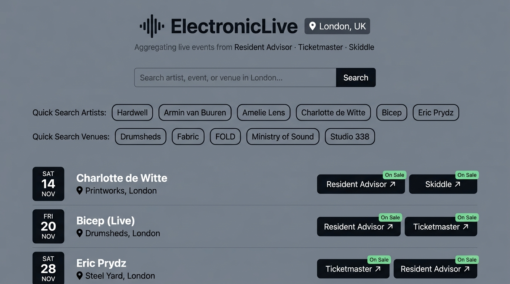
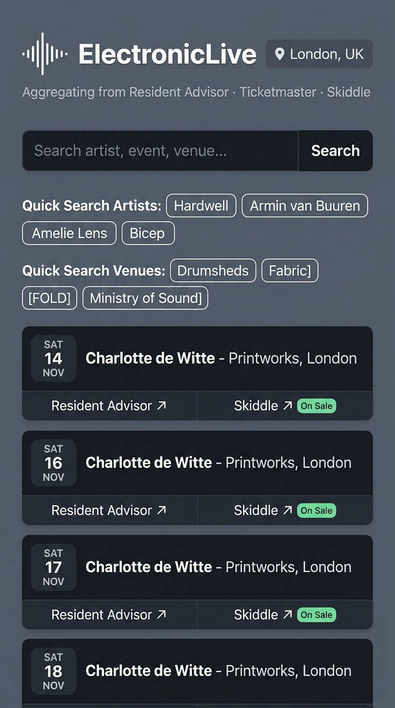

# ElectronicLive Client Specification

## 1. Overview & Product Mission

**ElectronicLive** is a focused web utility designed to discover upcoming electronic dance music (EDM) and live gigs across London venues by artist, event title, or venue. It operates as a Single-Page Application (SPA) backed by a decoupled .NET Minimal API aggregator that merges and deduplicates event data across **Resident Advisor**, **Ticketmaster**, and **Skiddle**.

### Core UX Principles
- **Utility-First & Lean:** Fast, responsive, and stripped of marketing clutter, carousels, and advertisements.
- **Data-First Hierarchy:** Search is a compact, focused tool; the event timetable occupies over 80% of the active viewport.
- **Chronological Orientation:** Events are displayed in strict chronological order with prominent date blocks for instant scanning.
- **One-Click Purchasing:** Side-by-side direct ticketing links with real-time availability badges. Zero nested menus or accordion clicks.

---

## 2. Approved UI Designs (Desktop & Mobile)

The visual design utilizes a mid-tone slate grey palette with high-contrast typography, interactive quick-search pills, and a chronological timetable row list.

### Desktop Layout


### Mobile Layout


### Palette & Visual Tokens
- **Base Background:** `#181b1f` (Dark slate grey, avoiding pitch black)
- **Elevated Surfaces / Rows:** `#22262d` (Zinc/charcoal container surface)
- **Row Hover State:** `#2b3039`
- **Border Lines:** `rgba(255, 255, 255, 0.08)` (Subtle 1px outlines for depth)
- **Primary Typography:** High-contrast neutral white (`#f3f4f6`)
- **Muted Typography / Meta:** Slate grey (`#9ca3af`)
- **Status Indicator (On Sale):** Emerald / mint green pill (`bg-emerald-950 text-emerald-400 border-emerald-800`)
- **Status Indicator (Sold Out):** Rose / red pill (`bg-rose-950 text-rose-400 border-rose-800`)

---

## 3. Component Architecture & Design Rationale

### Proposed Hierarchy

```
client/src/
├── api/
│   ├── client.ts                 # Typed fetch client targeting local .NET backend
│   └── types.ts                  # Domain contracts (EventResponse, EventTicketOffer, EventStatus, EventProvider)
├── components/
│   ├── common/
│   │   ├── Badge.tsx             # Reusable pill badge (Status, City, Provider)
│   │   ├── BrandLogo.tsx         # Inline SVG audio soundwave mark + typography
│   │   └── ErrorBoundary.tsx     # React error boundary with fallback banner
│   ├── layout/
│   │   ├── Header.tsx            # Brand mark, City scope badge, and Provider attribution
│   │   └── Container.tsx         # Responsive max-width wrapper
│   ├── search/
│   │   ├── SearchBar.tsx         # Text input with submit button and clear action
│   │   ├── QuickPillGroup.tsx    # Accessible horizontal pill container
│   │   └── QuickPills.tsx        # Pre-configured Artists & Venues pill rows
│   └── events/
│       ├── EventList.tsx         # Container rendering event rows or empty/skeleton states
│       ├── EventRow.tsx          # Chronological timetable row item
│       ├── DateBlock.tsx         # High-contrast calendar badge (Day, Date, Month)
│       ├── ProviderButton.tsx    # Direct outbound vendor ticket button
│       ├── EventSkeleton.tsx     # Pulsing skeleton rows for loading state
│       └── EmptyState.tsx        # Zero-results feedback card
├── features/
│   └── events/
│       ├── useEventsSearch.ts    # TanStack Query custom hook for search execution & caching
│       └── eventUtils.ts         # Date formatting, provider sorting, and URL helpers
├── App.tsx                       # Root view orchestrator
└── main.tsx                      # QueryClientProvider and DOM mount
```

### Architectural Rationale & Trade-offs

#### Why Domain & Feature Slicing?
- **Pros:**
  - **Single Responsibility (SRP):** Pure presentational components (`DateBlock`, `ProviderButton`, `Badge`) have zero knowledge of API fetching or React Query. They can be unit-tested in isolation in milliseconds without mocking HTTP calls.
  - **Encapsulated State via Custom Hooks (`useEventsSearch`):** All TanStack Query lifecycle logic (`isPending`, `isError`, caching, error handling) resides inside `src/features/events/useEventsSearch.ts`. UI components (`SearchBar`, `EventList`) merely call the hook and render states.
  - **Future Extensibility:** Replacing or augmenting the timetable list with a poster grid or adding date range filters only requires modifying `EventList` or `useEventsSearch` without touching the rest of the application.
- **Cons / Trade-offs:**
  - Slightly higher initial file count than grouping everything into a monolithic `App.tsx` and `EventCard.tsx`. However, for pair programming and multi-agent workflows, isolated files dramatically prevent merge conflicts and reduce cognitive load.

---

## 4. Detailed Functional Specifications

### 4.1. Header & Provider Attribution
- **Brand Identity:** Minimalist geometric soundwave SVG icon paired with bold sans-serif wordmark `ElectronicLive`.
- **Scope Chip:** Distinct pill reading `📍 London, UK`.
- **Provider Attribution:** Subtitle located directly beneath the title:
  > `Aggregating live events from Resident Advisor · Ticketmaster · Skiddle`
  - Explains the data perimeter upfront so users understand why closed platforms (such as DICE) are omitted.

### 4.2. Unified Search Section
- **Unified Query:** Single search input accepting artist names (e.g., *"Amelie Lens"*), event titles (e.g., *"A State Of Trance"*), or venue names (e.g., *"Drumsheds"*).
- **Trigger Mechanics:**
  - Fires on **Enter key** or clicking the **"Search"** button.
  - **No keystroke debouncing:** Live querying on keystroke is explicitly forbidden to prevent spamming upstream third-party rate limits.
- **Categorized Quick-Search Pills:**
  - **Quick Search Artists:** `Hardwell`, `Armin van Buuren`, `Amelie Lens`, `Charlotte de Witte`, `Bicep`, `Eric Prydz`.
  - **Quick Search Venues:** `Drumsheds`, `Fabric`, `FOLD`, `Ministry of Sound`, `Studio 338`.
  - Clicking any pill immediately populates the search input and executes the query.

### 4.3. Results Timetable (Desktop & Mobile Responsiveness)
- **Chronological Sorting:** Gigs are ordered ascending by date and door time. Unannounced dates appear at the end.
- **Desktop Anatomy (Horizontal Row):**
  1. **Date Block (Left):** Prominent day-of-week abbreviation (`SAT`), numerical date (`14`), and uppercase month (`NOV`).
  2. **Event & Venue Details (Center):** Artist / Event title in bold white; Venue name prefixed with map pin icon `📍`.
  3. **Direct Ticketing Actions (Right):** Side-by-side buttons (`[ Resident Advisor ↗ ]`, `[ Skiddle ↗ ]`) with `"On Sale"` indicators.
- **Mobile Anatomy (Stacked Card Layout):**
  1. **Top Sub-row:** Date Block alongside the Artist & Venue title.
  2. **Bottom Sub-row:** Full-width thumb-friendly ticket buttons spanning the width of the card side by side.

### 4.4. State Machine & Resilience UI
1. **Initial / Idle State:** Search bar and quick-search pills displayed cleanly; timetable list remains unrendered until a query is executed.
2. **Loading State:** 4–6 animated skeleton rows ([`EventSkeleton`](file:///Users/foysalahmed/Code/ElectronicLive/client/src/components/events/EventSkeleton.tsx)) mirroring the row layout to eliminate layout shift.
3. **Zero-Results State:** Centered card stating no upcoming London gigs were found across RA, Ticketmaster, or Skiddle.
4. **Network / Server Error State:** Error banner indicating connection failure with a `"Retry"` button.

---

## 5. Points of Concern, Trade-offs & Edge Cases

1. **Third-Party Upstream Latency:** Aggregator queries 3 APIs concurrently. Caching with TanStack Query (`staleTime: 5 * 60 * 1000`) avoids redundant requests when toggling between pills.
2. **Mobile Touch Targets:** All clickable pills and ticket buttons must have minimum 44px touch targets on mobile viewports.
3. **Missing Start Times:** Date block gracefully renders `TBA` when an event lacks a confirmed date or time.
4. **Venue Name Truncation:** Long venue strings truncate with ellipsis to prevent breaking card boundaries on narrow screens.
5. **CORS in Development:** Local Vite dev server proxies `/api` calls directly to the .NET API port.

---

## 6. Post-MVP Extensibility Roadmap

- **Filter Toolbar Seam:** Slot reserved between Quick Pills and Results for date range chips (*"This Weekend"*, *"Next 30 Days"*).
- **Personal Watchlist:** Header slot reserved for `[ Watchlist (count) ]` drawer trigger; [`EventRow`](file:///Users/foysalahmed/Code/ElectronicLive/client/) has reserved action slot for a bookmark icon.
- **View Switcher:** `EventList` can support toggling between `Timetable List` and `Poster Grid` if event images are added upstream.
