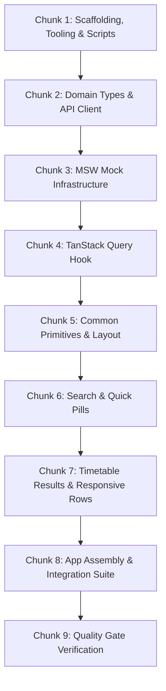

# Frontend Implementation Plan: ElectronicLive React Client

**References:**
- UI Specification & Mockups: [`docs/SPECIFICATION.md`](./SPECIFICATION.md)
- Operational Directives & Guardrails: [`../AGENTS.md`](../AGENTS.md)

> [!NOTE]
> **Living Document & Flexibility Directive:**
> This implementation plan is an adaptive roadmap, not a rigid or immutable contract. Executing agents are explicitly authorized and encouraged to adjust, reorder, or refine chunks as practical technical constraints, upstream discoveries, or unforeseen edge cases emerge during implementation. Always favor pragmatic engineering and working software over dogmatic adherence to initial plan steps.

---

## Phased Execution Overview

---

### Chunk 1: Scaffolding, Tooling & Configuration (COMPLETED - PR #13)
**Objective:** Initialize the React 19 + TypeScript + Tailwind + Vitest + ESLint project inside `client/`.

1. **Scaffold Vite Project:**
   - Initialized template: `npm create vite@latest . -- --template react-ts`.
2. **Dependencies & ESLint Flat Config:**
   - Production: `react@19`, `react-dom@19`, `@tanstack/react-query@5`.
   - Styling: `tailwindcss`, `@tailwindcss/vite`.
   - Testing: `vitest`, `@testing-library/react`, `@testing-library/user-event`, `@testing-library/jest-dom`, `jsdom`, `msw@2`.
   - ESLint Plugins: `typescript-eslint`, `eslint-plugin-react-hooks`, `eslint-plugin-react-refresh`, `@tanstack/eslint-plugin-query`.
3. **Configured `package.json` Scripts:**
   - `"dev"`, `"build"`, `"lint"`, `"typecheck"`, `"test"`, `"test:watch"`.
4. **Verification:**
   - Automated: Verified via CI/PR #13.

---

### Chunk 2: Core Domain Types & API Client
**Objective:** Establish strongly typed contracts matching the .NET backend.

1. **Contract Types (`src/api/types.ts`):**
   - Define `EventProvider` union (`'Ticketmaster' | 'Skiddle' | 'ResidentAdvisor'`).
   - Define `EventStatus` union (`'OnSale' | 'SoldOut' | 'Postponed' | 'Cancelled' | 'Unknown'`).
   - Define `EventTicketOffer` interface (`provider`, `ticketUrl: string | null`, `status`).
   - Define `EventResponse` interface (`id`, `name`, `venueName`, `date`, `time`, `ticketUrl: string | null`, `status`, `provider`, `offers`).
2. **Base API Client (`src/api/client.ts`):**
   - Export `fetchEvents(query: string, city?: string, signal?: AbortSignal): Promise<EventResponse[]>`.
   - Targets `/api/events/search?query=...&city=...`.
   - Handles HTTP 400 validation problems and 500 error responses with typed errors.
3. **Verification:**
   - Automated: `npm run typecheck` passes with zero type errors.

---

### Chunk 3: MSW (Mock Service Worker) Test Infrastructure
**Objective:** Enable offline, isolated component and hook testing without live server dependencies.

1. **MSW Handlers (`src/test/mocks/handlers.ts`):**
   - Mock `GET /api/events/search`:
     - Default success fixture returning multi-provider offers (RA + Skiddle + TM) and null ticketUrl edge case.
     - Handlers for empty results (`query=empty`) and server error (`query=error`).
2. **Test Setup (`src/test/setup.ts`):**
   - Initialize MSW server (`beforeAll`, `afterEach`, `afterAll`).
   - Extend Vitest with `@testing-library/jest-dom` matchers.
3. **Verification:**
   - Automated: Write and execute a test verifying MSW intercepts `/api/events/search`.

---

### Chunk 4: Custom Data Hook (`useEventsSearch`)
**Objective:** Encapsulate TanStack Query caching and search state management.

1. **Implement Hook (`src/hooks/useEventsSearch.ts`):**
   - Uses TanStack Query v5 object syntax: `useQuery({ queryKey, queryFn })`.
   - Query key: `['events', 'search', query.trim().toLowerCase()]`.
   - `enabled: Boolean(query.trim())`.
   - Caching: `staleTime: 5 * 60 * 1000` (5 minutes), `gcTime: 10 * 60 * 1000`.
   - **TanStack Query v5 Status Handling:**
     - Explicitly derive idle state: `const isIdle = !query.trim();`.
     - Expose active network status: `const isFetching = queryResult.isFetching;`.
     - In consumers, gate loading skeleton strictly on `isFetching`. Never check `isPending` alone when query is disabled.
   - Exposes: `{ events: data ?? [], isPending, isFetching, isError, error, refetch, isIdle }`.
2. **Unit Tests (`src/hooks/__tests__/useEventsSearch.test.ts`):**
   - `Should_fetch_and_cache_events_for_valid_query`
   - `Should_remain_idle_and_not_fetch_when_query_is_empty`
   - `Should_handle_api_errors_gracefully`
3. **Verification:**
   - Automated: `npm run test` (all hook tests pass).

---

### Chunk 5: Common Primitives & Global Layout
**Objective:** Build base UI components and page shell.

1. **Primitives & Layout:**
   - `src/components/common/Badge.tsx`: Status badges (`On Sale`, `Sold Out`) with green/red tokens.
   - `src/components/common/ErrorBoundary.tsx`: Fallback banner with retry button on network error.
   - `src/components/layout/Header.tsx`:
     - Geometric soundwave SVG brand mark + `ElectronicLive` typography.
     - Location badge `📍 London, UK`.
     - Attribution subtext: `Aggregating live events from Resident Advisor · Ticketmaster · Skiddle`.
2. **Unit Tests:**
   - `Should_render_header_with_branding_and_attribution`
   - `Should_render_status_badge_with_correct_theme`
3. **Verification:**
   - Automated: `npm run test`
   - Visual: Run `npm run dev` and verify header layout, logo, and badge alignment.

---

### Chunk 6: Search & Quick-Pill Controls
**Objective:** Implement the search input and categorized one-click pill filters.

1. **Components:**
   - `src/components/search/SearchBar.tsx`:
     - Input field with placeholder `"Search artist, event, or venue in London..."`.
     - Submit button `"Search"`. Triggers on Enter key or button click.
     - Never triggers on input `onChange`.
   - `src/components/search/QuickPills.tsx`:
     - Labeled rows: `Quick Search Artists:` and `Quick Search Venues:`.
     - Artists: `Hardwell`, `Armin van Buuren`, `Amelie Lens`, `Charlotte de Witte`, `Bicep`, `Eric Prydz`.
     - Venues: `Drumsheds`, `Fabric`, `FOLD`, `Ministry of Sound`, `Studio 338`.
     - Enforces `min-h-[44px]` touch target height and rounded pill styling.
2. **Unit Tests:**
   - `Should_trigger_search_on_form_submit`
   - `Should_trigger_search_when_quick_pill_clicked`
   - `Should_not_trigger_search_on_keystroke`
3. **Verification:**
   - Automated: `npm run test`
   - Visual: Run `npm run dev` and test typing, form submission, and pill click states.

---

### Chunk 7: Timetable Results & Responsive Event Row
**Objective:** Build the chronological results list, mobile card adaptation, and resilience states.

1. **Components:**
   - `src/components/events/DateBlock.tsx`:
     - High-contrast Day, Date, Month box.
     - **Timezone-Safe Parsing:** Parse `"YYYY-MM-DD"` via string split or UTC getters (`getUTCDate()`, `getUTCMonth()`).
     - Falls back gracefully to `TBA` when date is missing.
   - `src/components/events/ProviderButton.tsx`:
     - Outbound ticket button with availability badge (`target="_blank"`).
     - **Null Link Handling:** Renders unclickable disabled state (`Tickets TBA`) when `ticketUrl` is null/empty.
   - `src/components/events/EventRow.tsx`:
     - Desktop (`>= 640px`): Horizontal row with intermediate viewport wrapping (`flex-wrap gap-2`).
     - Mobile (`< 640px`): Stacked card with thumb-friendly buttons.
     - Multi-Provider Scaling Matrix (1, 2, or 3 providers per `SPECIFICATION.md#5.2`).
   - `src/components/events/EventSkeleton.tsx`: Animated loading rows matching timetable dimensions.
   - `src/components/events/EmptyState.tsx`:
     - Idle mode: Renders prompt *"Select a London artist or club above, or search to view upcoming shows."*
     - Zero-results mode: Informs user that no events were found across RA, TM, and Skiddle.
   - `src/components/events/EventList.tsx`: Orchestrates `isIdle`, `isFetching`, `isError`, and data rendering.
2. **Unit Tests:**
   - `Should_render_timetable_rows_chronologically`
   - `Should_parse_dates_without_timezone_day_shift`
   - `Should_render_disabled_button_when_ticket_url_is_null`
   - `Should_render_skeleton_state_while_fetching`
   - `Should_render_idle_prompt_when_no_query_entered`
   - `Should_render_empty_state_when_zero_results`
   - `Should_render_multiple_providers_according_to_scaling_matrix`
3. **Verification:**
   - Automated: `npm run test`
   - Visual: Run `npm run dev` and verify responsive row layout on desktop, tablet (768px), and mobile viewport (< 640px).

---

### Chunk 8: Full App Assembly & Integration Suite
**Objective:** Wire all components into `App.tsx`, synchronize URL deep-linking, and verify full user journey.

1. **Integration (`src/App.tsx`):**
   - Header $\rightarrow$ SearchBar $\rightarrow$ QuickPills $\rightarrow$ EventList.
   - **URL Synchronization:**
     - Initialize query state from `new URLSearchParams(window.location.search).get('q') || ''`.
     - Update browser URL via `window.history.replaceState` when query changes.
2. **End-to-End Component Tests (`src/__tests__/App.test.tsx`):**
   - `Should_display_idle_prompt_on_initial_load`
   - `Should_initialize_search_from_url_query_parameter`
   - `Should_execute_search_and_render_events_when_pill_is_clicked`
   - `Should_display_empty_state_when_no_events_found`
   - `Should_display_error_banner_and_retry_when_backend_fails`
3. **Verification:**
   - Automated: `npm run test`
   - Visual: Run `npm run dev` and test browser refresh with `?q=fabric` preserving search state.

---

### Chunk 9: Quality Gate Verification
**Objective:** Strict compliance verification per [`client/AGENTS.md`](../AGENTS.md).

1. **Commands:**
   - `npm run lint` $\rightarrow$ Zero ESLint warnings or errors.
   - `npm run typecheck` $\rightarrow$ Strict Mode check, zero `any` or unsafe `as` casts.
   - `npm run test` $\rightarrow$ 100% passing tests following `Should_...` naming.
   - `npm run build` $\rightarrow$ Clean production build bundle in `dist/`.
